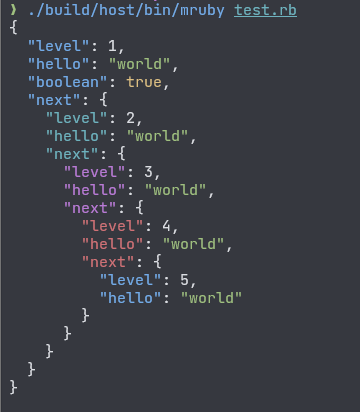

# mruby-yyjson

[yyjson](https://github.com/ibireme/yyjson) binding for mruby.

## Installation

Add conf.gem line to `build_config.rb`:

```ruby
MRuby::Build.new do |conf|
-- snip --

  conf.gem github: 'buty4649/mruby-yyjson'
end
```

## Implemented Method

| Method                  | mruby-yyjson | Memo                             |
|-------------------------|--------------|----------------------------------|
| JSON.[]                 | ✓            |                                  |
| JSON.create_id          |              |                                  |
| JSON.create_id=         |              |                                  |
| JSON.generator          |              |                                  |
| JSON.parser             |              |                                  |
| JSON.state              |              |                                  |
| JSON.#dump              | ✓            |                                  |
| JSON.#fast_generate     | ✓            | same as JSON.generate(obj)       |
| JSON.#fast_unparse      |              | obsolete                         |
| JSON.#generate          | ✓            |                                  |
| JSON.#unparse           |              | obsolete                         |
| JSON.#load              | ✓            |                                  |
| JSON.#load_file         | ✓            | require `mruby-io`               |
| JSON.#load_file!        |              |                                  |
| JSON.#restore           |              |                                  |
| JSON.#parse             | ✓            |                                  |
| JSON.#parse!            |              |                                  |
| JSON.#pretty_generate   | ✓            |                                  |
| JSON.#pretty_unparse    |              | obsolete                         |
| JSON.#colorize_generate | ✓            | mruby-yyjson specific extension  |
||||
| Object#to_json          | ✓            |                                  |

## Colorize



The `mruby-yyjson` library now supports colorized JSON output, making it easier to read and debug complex JSON structures. By setting the `colorize` option to `true` in the `JSON.color_generate` or `JSON.generate` methods, you can achieve syntax-highlighted JSON output. This feature enhances the readability of nested JSON data by differentiating keys, strings, numbers, booleans, and other elements with distinct colors.

### Default Colors

- `null`: gray
- `boolean`: yellow
- `number`: default (no specific color)
- `Object keys`: Colors vary by hierarchy level
  - Level 1: blue
  - Level 2: cyan
  - Level 3: magenta
  - Level 4: red
  - Levels 5 and beyond: cycle through blue, cyan, magenta, and red again

### Customizing Colors

You can customize these colors using the following methods:

- `JSON.color_null`: Sets the color for `null` values
- `JSON.color_boolean`: Sets the color for `boolean` values
- `JSON.color_number`: Sets the color for `number` values
- `JSON.set_color_object_key(level, color)`: Sets the color for object keys at a specific hierarchy level

Refer to [mruby-terminal-color](https://github.com/buty4649/mruby-terminal-color) for details on specifying colors.

## License

mruby-yyjson is licensed under the MIT License.

This project includes code from the yyjson library, specifically [yyjson.c](src/yyjson.c) and [yyjson.h](src/yyjson.h), which are licensed under the MIT License. A copy of the MIT License can be found in the [LICENSE](./LICENSE) file in the root of this repository.
